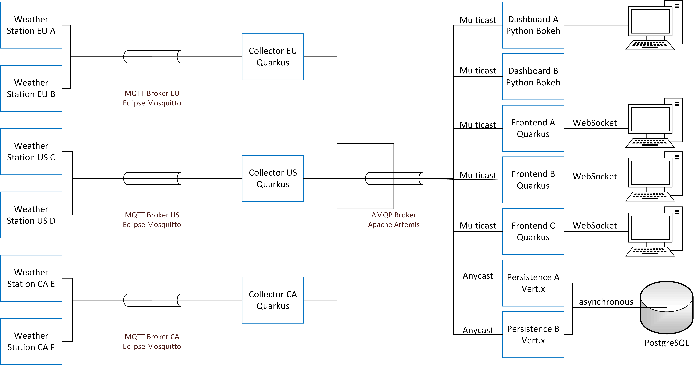

<!-- START doctoc generated TOC please keep comment here to allow auto update -->
<!-- DON'T EDIT THIS SECTION, INSTEAD RE-RUN doctoc TO UPDATE -->
**Table of Contents**  *generated with [DocToc](https://github.com/thlorenz/doctoc)*

- [Architektur](#architektur)
  - [MQTT mit Eclipse Mosqitto](#mqtt-mit-eclipse-mosqitto)
    - [Collector (aus Architektursicht)](#collector-aus-architektursicht)
  - [AMQP](#amqp)
    - [AMQP mit Apache ActiveMQ Artemis](#amqp-mit-apache-activemq-artemis)
    - [Bestätigungen](#best%C3%A4tigungen)
    - [Serialisierungsformat](#serialisierungsformat)
  - [Skalierbarkeit](#skalierbarkeit)
    - [Collector](#collector)
    - [Frontend und Dashboard](#frontend-und-dashboard)
    - [Persistence](#persistence)
    - [Demonstration](#demonstration)
- [Wetterstationen](#wetterstationen)
  - [Nachrichtenformat](#nachrichtenformat)
  - [Simulator](#simulator)
  - [ESP8266-basierte Wetterstation](#esp8266-basierte-wetterstation)
- [Collector](#collector-1)
  - [Design](#design)
  - [Implementierung](#implementierung)
  - [Konfiguration](#konfiguration)
- [Frontend](#frontend)
  - [Design](#design-1)
  - [Implementierung](#implementierung-1)
  - [React SPA](#react-spa)
- [Persistence](#persistence-1)
  - [Design](#design-2)
    - [Behandlung von Duplikaten](#behandlung-von-duplikaten)
  - [Implementierung und Konfiguration](#implementierung-und-konfiguration)
- [Dashboard](#dashboard)
  - [Design](#design-3)
  - [Implementierung und Konfiguration](#implementierung-und-konfiguration-1)
    - [Asynchronität](#asynchronit%C3%A4t)
- [Testfälle](#testf%C3%A4lle)
  - [ESP8266-basierte Wetterstation und Dashboard](#esp8266-basierte-wetterstation-und-dashboard)
  - [Erkennung duplizierter Nachrichten](#erkennung-duplizierter-nachrichten)
  - [Skalierbarkeit](#skalierbarkeit-1)

<!-- END doctoc generated TOC please keep comment here to allow auto update -->

# Architektur

Die folgende Abbildung zeigt die Architektur des Systems.
Die Wetterstationen generieren Wetteraufzeichnungen und senden diese an den MQTT-Broker.
Der Collector-Service hört auf die Nachrichten, welcher der MQTT-Broker veröffentlicht, konvertiert diese und leitet sie an den AMQP-Broker weiter.
Die Web-Frontend-Services schicken die aktuellsten Wetterdaten der jeweils ausgewählten Station über eine WebSocket-Verbindung an eine beliebige Anzahl an Browser, wobei jede Browser-Verbindung getrennt über eine Session behandelt wird.
Das Dashboard bietet eine Übersicht über die aktuellsten Wetterdaten einer Station.
Die Persistierung der Wetterdaten in eine PostgreSQL-Datenbank übernehmen die Persistence-Services mittels eines asynchronen JDBC-Treibers, was eine hohe Performance ermöglichen soll.



## MQTT mit Eclipse Mosqitto

Alexander

### Collector (aus Architektursicht)

- MQTT-QoS Level 2 --> Funktioniert das überhaupt so, dass der Publisher mit QoS 0 sendet und der Consumer mit QoS 2 Nachrichten empfängt?

Alexander

## AMQP

AMQP 1.0 stellt im Vergleich zu AMQP 0-9-1 ein komplett verändertes Protokoll dar, welches überhaupt nicht mehr kompatibel ist.
Die Hauptunterschiede umgeben sich aus dem Umfang der Protokolle.
AMQP 0-9-1 definiert neben dem Binärprotokoll noch die Broker-Architektur, was zur Folge hat, dass sich Unterstützung für AMQP 0-9-1 nur bedingt in bestehende Broker integrieren lässt.
AMQP 1.0 definiert lediglich das Binärprotokoll und ist von den Konzepten wie Brokern, Exchanges, Bindings, Queues unabhängig, obwohl es diese weiterhin geben kann, allerdings implementierungsabhängig.
Deshalb bietet AMQP 1.0 ebenfalls keine Befehle zum Verwalten des Brokers, wie z.B. das Definieren und Löschen von Queues.

AMQP 1.0 geht dabei sogar so weit, dass es nicht einmal die Existenz von Brokern vorschreibt.
Zwei Clients können auch direkt miteinander ohne Broker kommunizieren.
Dies erlaubt die Erstellung von Zwischenkomponenten, die keine Broker im eigentlichen Sinn sind.
Ein Beispiel hierfür ist der [Apache Qpid Dispatch Router](https://qpid.apache.org/components/dispatch-router/).

Da viele Implementierungen mittlerweile nur noch AMQP 1.0 unterstützen, wie z.B. MicroProfile Reactive Messaging, für welches Quarkus die [Implementierung von SmallRye](https://smallrye.io/smallrye-reactive-messaging/smallrye-reactive-messaging/2/index.html) verwendet, haben wir uns entschieden, diese Aufgabe mit AMQP 1.0 umzusetzen.

AMQP 1.0 definiert die folgenden Komponenten

- Eine Verbindung ist eine vollduplex, verlässliche, geordnete Sequenz von Frames, die über den Kommunikationskanal übertragen werden.
- Eine Session fasst eine beliebige Anzahl von unabhängigen Links zusammen. Die Session übernimmt dabei den Sequenz- und Kontrollfluss auf Frameübertragungsebene.
- Ein Link ist eine unidirektionale Route zwischen einer Quelle und einem Ziel, über welche die Nachrichten übertragen werden. Ein Link übernimmt dabei die Flusskontrolle auf Nachrichtenebene.

Aus Perspektive der AMQP-Clients sind die Namen des Quell- und Zielobjekts Bezeichner aus dem Namensraum des Verbindungspartners.
So sind diese für unser Projekt Bezeichner aus dem Namesraum des Apache-Artemis-Brokers, nämlich Addressen und Queues.

### AMQP mit Apache ActiveMQ Artemis

Apache ActiveMQ Artemis ist ein hochperformantes, asynchrones Open-Source-Messaging-System, welches eine Vielzahl an Protokollen unterstützt und Clusterfähigkeiten bietet.
Artemis unterstützt dabei zwei Arten von Messaging: Message-Queue-Messaging, welches auch als Punkt-zu-Punkt-Messaging bezeichnet wird, und Publish-Subscribe-Messaging.

Bei Punkt-zu-Punkt-Messaging wird die Nachricht an genau einen der Consumer weitergeleitet, welcher die Nachricht abarbeitet und bestätigt oder ablehnt.
Bei einer Bestätigung wird die Nachricht aus der Queue entfernt, während sie bei einer Ablehnung wieder in die Queue gestellt wird und somit später verarbeitet werden kann.
Da eine Nachricht nur einmal an einen Consumer zugestellt wird, ist sichergestellt, dass die Nachricht nicht mehrmals verarbeitet wird.
Deshalb wird Punkt-zu-Punkt-Messaging zur Verteilung von Nachrichten an mehrere Persistence-Services eingesetzt.

Das Publish-Subscribe-Model entspricht Topics in MQTT und JMS: Jede der beliebig vielen Subscriptions für ein Topic erhält eine Kopie jeder Nachricht zugestellt.
Darüber hinaus kann zusätzlich die Durable-Eigenschaft für eine Queue aktiviert werden, die bewirkt, dass eine Kopie einer Nachricht bis zur Zustellung an den Subscriber im Broker gespeichert wird, wodurch Offline-Zeiten der Subscriber (z.B. durch Wartung oder Versionsupgrades) überbrückt werden können.
Das Publish-Subscribe-Modell wird für die Fronten-Services (Web-Frontend und Dashboard) verwendet, da diese einen Zugriff auf die Wetterdaten aller Wetterstationen ermöglichen sollen.
Die Queues des Dashboard sind als durable gekennzeichnet, um auch Wetterdaten, die während einer Offline-Zeit einer Dashboard-Instanz eingehen, anzeigen zu können.
Da das Web-Frontend immer nur die aktuellsten Werte anzeigen soll und Wetterdaten, die während eines Offline-Fensters eingehen, als veraltet gelten, werden wird der Non-Durable-Mode verwendet.

Das Adressmodell von Apache ActiveMQ Artemis, welches aufgrund der erhöhten Flexibilität in AMQP 1.0 auch auf die Clients angewandt werden kann, besteht aus drei wesentlichen Komponenten: Adressen, Queues und Routing-Types.

Eine Adresse repräsentiert einen Messaging-Endpunkt und verfügt über einen eindeutigen Namen, beliebig viele zugeordnete Queues und einen Routing-Type.
Ein Producer sendet die Nachrichten an eine Adresse, welche dann an die Queues weitergeroutet werden.

Eine Queue ist mit einer Adresse asoziiert, wobei es beliebig viele Queues pro Adresse geben kann.
Sobald eine Nachricht an eine Adresse angelangt ist, wird sie abhängig vom Routing-Type an die Queues weitergeleitet.

Der Routing-Type entscheidet, wie für eine Adresse eingegange Nachrichten an die mit der Adresse assoziierten Queues weitergeleitet werden.
ActiveMQ Artemis kennt dabei zwei verschiedene Routing-Typen: Anycast, welcher dem Punkt-zu-Punkt-Messaging-Modell entspricht, und Multicast, welcher dem Publish-Subscribe-Messaging-Modell entspricht.
Bei Anycast wird die Nachricht also nur an eine der asoziierten Queues weitergeleitet, während sie bei Multicast an alle Queues verteilt wird.
Für weitere Details hierzu sei [auf die sehr gute Dokumentation verwiesen](https://activemq.apache.org/components/artemis/documentation/latest/address-model.html)-

Nun ergibt sich das Problem, dass für eine Adresse zwei verschiedene Routing-Types verwendet werden sollen, da der Persistence-Service andere Anforderungen als die Frontend-Services haben.
Während dies z.B. für JMS möglich ist, da es möglich ist, sowohl eine Queue als auch ein Topic mit gleichem Namen zu haben und durch die konzeptionelle Trennung unterschieden wird, ist dies für AMQP 1.0 nicht mehr möglich.
Laut Dokumentation wird sich ein Client bei der Verwendung von beiden Routing-Types mit AMQP 1.0 standardmäßig auf die Anycast-Queue verbinden, was sich in Tests auch bewahrheitet hat.
Für Details hierzu [siehe den Abschnitt "Point-to-Point and Publish-Subscribe Addresses" in der Dokumentation](https://activemq.apache.org/components/artemis/documentation/latest/address-model.html).

Eine Möglichkeit wäre gewesen, den Collector-Service zu erweitern, was jedoch der losen Kopplung, die mit einem Message-Queueing-Protokoll erreicht werden soll, widerspricht.
Daher haben wir uns entschieden, für den Anycast-Betrieb eine zusätzliche Adresse zu definieren und mittels eines [Diverts](https://activemq.apache.org/components/artemis/documentation/latest/diverts.html) den Nachrichtenfluss für die ursprüngliche Adresse so aufzuteilen, dass Nachrichten, die für die ursprüngliche Adresse bestimmt sind weiterhin an diese zugestellt werden und zusätzlich an die neue Adresse für den Anycast-Betrieb kopiert werden.
Hierfür wird die Semantik eines nichtexklusiven Diverts verwendet.
Da wir einige Stunden zum Finden der Lösung verbracht haben, zeigt sich hier ein Nachteil in der nichtstandardisierten Broker-Konfiguration von AMQP 1.0 im Vergleich zu AMQP 0-9-1.

Abschließend zeigt das folgende Snippet noch die Konfiguration des Apache ActiveMQ Artemis-Brokers für AMQP.

```xml
<?xml version="1.0" encoding="UTF-8" standalone="no"?>
<configuration xmlns="urn:activemq" xmlns:xsi="http://www.w3.org/2001/XMLSchema-instance" xsi:schemaLocation="urn:activemq /schema/artemis-configuration.xsd">
	<core xmlns="urn:activemq:core" xsi:schemaLocation="urn:activemq:core ">
		<addresses>
			<address name="measurement-records">
				<multicast />
			</address>
			<address name="measurement-records-persistence">
				<anycast>
					<queue name="measurement-records-persistence" />
				</anycast>
			</address>
		</addresses>
		<diverts>
			<divert name="measurement-records-persistence-forwarding">
				<address>measurement-records</address>
				<forwarding-address>measurement-records-persistence</forwarding-address>
				<exclusive>false</exclusive>
			</divert>
		</diverts>
	</core>
</configuration>
```

### Bestätigungen

Das Festlegen, welche Nachrichten auf Sender- und Empfänger-Seite ob und wie bestätigt werden, ist ein essentieller Teil eines Messaging-Protokolls.
AMQP definiert zur Festlegung der Zuverflässigkeits- und Performanceanforderungen zwei verschiedene QoS-Stufen (Quality-of-Service) sowohl auf Sender- als auch auf Empfängerseite.
Für beide Seiten sind die folgenden QoS-Level definiert:

- At-most-Once (Level 0)
- At-least-Once (Level 1)

Auf Publisher-Seite bedeutet Level 0, dass der Publisher nicht auf eine Bestätigung vom anderen Endpunkt wartet, bevor die Nachricht verworfen wird, wohingegen bei Level 1 der Publisher eine Nachricht nur nach erhaltener Besätigung aus der Queue entfernt.
Auf Subscriber-Seite hat der QoS-Level 0 zur Folge, dass der Queue-Manager nach dem Senden einer Nachricht diese sofort aus der Queue entfernt, egal ob eine Besätigung eintrifft oder nicht, während bei QoS-Level 1 das Entfernen einer Nachricht aus der Queue nur nach Erhalt einer Bestätigung durch den Subscriber erfolgt.

Da Wetterdaten, welche der Collector über MQTT empfängt nicht verloren gehen sollen, verwendet der Collector auf AMQP-Seite QoS-Level 1.
Ebenso soll gewährleistet werden, dass Wetterdaten verlässlich in der Datenbank gespeichert werden, weswegen der Persistence-Service ebenfalls QoS-Level 1 verwendet.
Wenn auf Seiten des Web-Frontends oder des Dashboards Nachrichten verloren gehen, hat dies keine wesentlichen Auswirkungen und daher arbeiten diese Systeme mit QoS-Level 0, um die Performance zu verbessern.

### Serialisierungsformat

Wir haben versucht das in [AMQP 1.0 definierte Typsystem](https://en.wikipedia.org/wiki/Advanced_Message_Queuing_Protocol#Type_system) zu verwenden.
Leider ist die Quarkus-Implementierung von MicroProfile Reactive Messaging, welche im Collector-Service zum Einsatz kommt, nicht in der Lage, Java-Objekte in entsprechende AMQP-Datentypen zu konvertieren.
Für diese wird beim Erstellen von Nachrichten einfach die Methode `toString` aufgerufen.
Eine Alternative wäre gewesen, eine [Library, welche die Serialisierung vornimmt](https://github.com/xinchen10/amqp-io) zu verwenden.
Allerdings führt dieser Ansatz oft mit neueren Datentypen (z.B. das in Java 8 hinzugekommene `LocalDateTime`) zu Problemen.
Weiters ist so eine Serialisierung zusätzlicher Code-Aufwand, welcher einen Cross-Cutting-Concern darstellt.
Bei solchen Anforderungen wäre es aus unserer Sicht besser, ein weiter verbreitetes Serialiserungsprotokoll wie [ProtocolBuffers](https://developers.google.com/protocol-buffers/) oder [Cap'n Proto](https://capnproto.org/) zu verwenden.

## Skalierbarkeit

Die Architektur ist so ausgelegt, dass eine Skalierung durch Hoch- und Runterfahren zusätzlicher Instanzen der Komponenten erreicht werden kann.
Im Folgenden wird auf die Skalierbarkeit der einzelnen Komponenten eingegangen und abschließend die Ergebnisse einer kleinen Demonstration festgehalten.

### Collector

Für jeden zusätzlichen Collector muss ein zusätzlicher MQTT-Broker betrieben werden.
Dies ergibt sich daraus, dass MQTT nur Topics besitzt und daher die Nachrichten nur im Multicast-Verfahren an alle Teilnehmer gesendet werden.
Würden an einem MQTT-Broker mehrere Collector sich auf Nachrichten registrieren, würde daher jeder Collector jede Nachricht erhalten und diese an den AMQP-Broker weiterleiten.
Dies würde zu vielen duplizierten Nachrichten führen, welche sich stark negativ auf die Performance auswirken.

Aus diesen Gründen haben wir uns für die Architektur mit genau einem Collector pro Broker entschieden.
Da die MQTT-Broker ebenfalls relativ leichtgewichtig sind, ist dies auch kein allzu großes Problem.

### Frontend und Dashboard

Da Nachrichten von der AMQP-Queue aufgrund des in Apache Artemis konfigurierten Multicast-Verhalten an alle Frontend-Services (Web-Frontend und Dashboard) weitergeleitet werden, können von diesen je nach Last die benötigte Anzahl an Instanzen gestartet und gestoppt werden.
Dadurch können Lastspitzen sehr gut abgedeckt werden.

### Persistence

Die Persistence-Services verwenden eine Queue, die von Apache Artemis intern als Anycast-Queue verwaltet wird.
Dadurch wird eine Nachricht immer nur an einen Persistence-Service weitergeleitet, wodurch die Last auf mehrere Services aufgeteilt werden kann.
Duplikate werden dadurch vermieden.

### Demonstration

Die Demonstration der Skalierbarkeit erfolgt im Rahmen der Dokumentation der Testfälle.
[Daher sei an dieser Stelle auf das entsprechende Kapitel gegen Ende des Protokolls verwiesen](#skalierbarkeit-1)

# Wetterstationen

## Nachrichtenformat

Alexander

CSV-Format und Topic-Namen beschreiben

## Simulator

Alexander

## ESP8266-basierte Wetterstation

Die unten folgende Abbildung zeigt ein Foto der hardwarebasierten Wetterstation.
Diese verwendet einen DHT22-Sensor zur Messung der Temperatur und der Luftfeuchtigkeit sowie einen BME280-Sensor zur Messung des Luftdrucks.
Der ESP8266-Mikrocontroller wird in MicroPython, einem Python-Dialekt für Embedded-Systems, angesteuert.
Der [Quellcode für die Wetterstation findet sich natürlich in unserem Repository](weatherStationMicropython/weatherStation.py).


Einer der großen Vorteile von MicroPython ist die für Mikrocontroller umfangreiche Bibliothek, welche neben einem Treiber für den DHT22-Sensor auch eine minimale MQTT-Implementierung mitbringt.
Über diese werden die Messages an den jeweiligen Eclipse Mosquitto-Broker gesendet.
Die MQTT-Implementierung unterstützt die QoS-Stufen 0 und 1, wobei standardmäßig Stufe 0 aktiviert ist.
Dies ist für die Zwecke einer simplen Wetterstation völlig ausreichend und da sich daraus die geringsten Anforderungen an die Hardware ergeben, verwenden wir auch diese Variante.

# Collector

Die Aufgabe des Collector-Services ist es, sich als Subscriber für Wetterdaten, die über MQTT übertragen werden, zu registrieren, dies zu konvertieren und sie anschließend an eine AMQP-Adresse weiterzuleiten.
Der Collector-Service ist mit [Quarkus](https://quarkus.io/) und mit dessen Implementierung von [MicroProfile Reactive Messaging 1.0](https://download.eclipse.org/microprofile/microprofile-reactive-messaging-1.0/microprofile-reactive-messaging-spec.pdf), welche auf der [SmallRye-Implementierung](https://smallrye.io/smallrye-reactive-messaging/smallrye-reactive-messaging/2/) beruht, realisiert.

## Design

MicroProfile Reactive Messaging abstrahiert Nachrichten von mehreren Message-Queueing-Technologien (momentan MQTT, AMQP 1.0 und Apache Kafka) in Streams und ermöglicht es, CDI-Beans, welche die Nachrichten eines Stream verarbeiten, zu definieren.
Messages werden innerhalb einer Applikation über Channels übertragen.
Ein Channel ist ein virtuelles Ziel, welches mit einem Namen identifiziert wird.
Die MicroProfile Reactive Messaging-Implementierung stellt anschließend eine Verbindung zwischen Channels und CDI-Beans, welche die Nachrichten eines eingehenden Channels verarbeiten und/oder neue Nachrichten auf einen ausgehenden Channel senden, her.
Eine gute Illustration zeigt das folgende Bild aus der Dokumentation von SmallRye Reactive Messaging.


Ein Connector stellt anschließend die Verbindung zwischen einem Chanell und einem Message-Broker her.
Dabei werden von einem Broker gesendete Nachrichten auf einen eingehenden Kanal gemappt und von einem Kanal ausgehende Nachrichten gesammelt an einen Broker geschickt.
Der Broker kann es sich dabei entweder eine MQTT-, eine AMQP- oder eine Kafka-Instanz handeln.
Dies wird wiederum in der SmallRye-Dokumentation sehr anschaulich illustriert:


Eine Nachricht setzt sich in der MicroProfile Reactive Messaging-Spezifikation aus Metadaten und Payload zusammen und werden grundsätzlich durch die Klasse `Message<T>` repräsentiert.
Die Spezifikation legt dabei fest, dass auch Broker-abhängige Metadaten, wie z.B. das Topic in MQTT, über spezielle Klassen, welche das Interface `Message<T>` erweitern und von der Implementierung beisteuert werden, zugegriffen werden kann.
Ein Beispiel ist die Klasse `MqttMessage<T>` [der SmallRye-Implementierung](https://github.com/smallrye/smallrye-reactive-messaging/blob/master/smallrye-reactive-messaging-mqtt/src/main/java/io/smallrye/reactive/messaging/mqtt/MqttMessage.java), welche eine MQTT-Nachricht repräsentiert und über die auf das Topic zugegriffen werden kann.

## Implementierung

Die wichtigste Komponente ist das CDI-Bean `MqttCollector`, dessen Quellcode im unteren Snippet gezeigt wird.
Die Spezifikation MicroProfile Reactive Messaging legt fest, dass Beans, welche einen Stream von Nachrichten verarbeiten, entweder mit `@ApplicationScoped`.
Um die ID der Wetterstation aus dem Topic der MQTT-Nachricht extrahieren zu können, wird der Topic-Präfix als Konfigurationsparameter injiziert.
Die Implementierung nimmt dabei Mqtt-Nachrichten aus dem Channel `mqtt-sensor-data` entgegen, was durch die Annotation `@Incoming("mqtt-sensor-data")` festgelegt wird, verarbeitet diese und leitet sie an den Channel `amqp-measurement-records` weiter, was die Annotation `@Outgoing("amqp-measurement-records")` bewirkt.
Die Annotation `@Acknowledgment(Acknowledgment.Strategy.MANUAL)` stellt den Zeitpunkt des Sendens der Bestätigung für die empfangene Nachricht vom standardmäßigen Bestätigen vor Ausführung der annotierten Methode auf Bestätigung durch den Implementierer um.
Dadurch kann erreicht werden, dass Nachrichten erst nach der wirklichen Verarbeitung besätigt werden.
Hierdurch wird auch für die ausgehenden Nachrichten das AMQP-QoS-Level 1 automatisch durch die Implementierung festgelegt.
Abschließend legt die Annotation `@Broadcast` noch fest, dass ausgehende Nachrichten an alle Subscriber dispatcht werden.

Das Besätigen der eingehenden Nachrichten erfolgt über ein Idiom, welches in der Spezifikation zu [MicroProfile Reactive Messaging 1.0](https://download.eclipse.org/microprofile/microprofile-reactive-messaging-1.0/microprofile-reactive-messaging-spec.pdf) beschrieben wird (Seite 27): Die eingehende Nachricht wird mittels eines Callbacks erst dann bestätigt, nachdem die ausgehende Nachricht versendet wurde.

```java
@ApplicationScoped
public class MqttCollector {
	private final String topicPrefix;

	@Inject
	public MqttCollector(@ConfigProperty(name = "mqtt.topic-prefix") String topicPrefix) {
		this.topicPrefix = topicPrefix;
	}

	@Incoming("mqtt-sensor-data")
	@Outgoing("amqp-measurement-records")
	@Acknowledgment(Acknowledgment.Strategy.MANUAL)
	@Broadcast
	public Message<String> processMeasurement(MqttMessage<byte[]> message) {
		long weatherStationId = MqttMessageParser.parseWeatherStationId(message.getTopic(), this.topicPrefix);
		String payload = new String(message.getPayload());
		MeasurementDto measurement = MqttMessageParser.parseMeasurementCsv(payload);
		LocalDateTime timestamp = LocalDateTime.now()
				.truncatedTo(ChronoUnit.SECONDS);
		RecordDto record = new RecordDto(weatherStationId, timestamp, measurement);
		return Message.of(
				RecordJsonConverter.toJson(record).toString(),
				message::ack
		);
	}
}
```

## Konfiguration

Die Connectoren, welche die Channels mit den Brokern verbinden, werden in der Konfiguration der Anwendung festgelegt.
Die möglichen Eigenschaften sind dabei wieder implementierungsabhängig (siehe Dokumentation zu [AMQP](https://smallrye.io/smallrye-reactive-messaging/smallrye-reactive-messaging/2/amqp/amqp.html) und [MQTT](https://smallrye.io/smallrye-reactive-messaging/smallrye-reactive-messaging/2/mqtt/mqtt.html) in SmallRye Reactive Messaging).
Im ersten Block wird der eingehende Channel `mqtt-sensor-data` mit allen MQTT-Topics, die mit der Bezeichnung `sensor-data` beginnen und anschließend eine beliebige Stations-ID als zweiten Bestandteil haben verbunden.
Darüber hinaus wird das QoS-Level noch entsprechend gesetzt und eine Client-ID zur besseren Identifizierung am Broker festgelegt.

Der zweite Block legt die grundlegenden Eigenschaften zur Verbindung mit dem AMQP-Broker fest, während der dritte Block die Verbindung zwischen dem ausgehenden Channel `amqp-measurement-records` und der AMQP-Adresse `measurement-records` festlegt.
Die Festlegung der Container-ID dient wieder zur besseren Identifizierbarkeit am AMQP-Broker, da ansonsten eine UUID verwendet wird.
Wichtig ist noch, dass festgelegt wird, dass die Queues durable sind, also auch bei Verbindungsabrissen bestehen bleiben.

```properties
mp.messaging.incoming.mqtt-sensor-data.client-id = eu.collector.mqtt
mp.messaging.incoming.mqtt-sensor-data.auto-generated-client-id = false
mp.messaging.incoming.mqtt-sensor-data.type = smallrye-mqtt
mp.messaging.incoming.mqtt-sensor-data.topic = sensor-data/+
mp.messaging.incoming.mqtt-sensor-data.host = 127.0.0.1
mp.messaging.incoming.mqtt-sensor-data.port = 1883
mp.messaging.incoming.mqtt-sensor-data.qos = 2

# set the AMQP broker credentials
amqp-host = 127.0.0.1
amqp-port = 5672
amqp-username = weatherdata
amqp-password = thunderstorm

# configure the AMQP connector to write to the `persisted-sensor-values` address
mp.messaging.outgoing.amqp-measurement-records.connector = smallrye-amqp
mp.messaging.outgoing.amqp-measurement-records.address = measurement-records
mp.messaging.outgoing.amqp-measurement-records.containerId = collector
mp.messaging.outgoing.amqp-measurement-records.durable = true

mqtt.topic-prefix = sensor-data/
```

# Frontend

Alexander

## Design

## Implementierung

Annotationen + Konfiguration (`application.properties`) erklären

## React SPA

Alexander

# Persistence

Der Zweck des Persistence-Services ist es, die eingehenden Wetternachrichten in einer PostgreSQL-Datenbank abzuspeichern.
Um auch andere Implementierungen als das in Quarkus verwendete SmallRye Reactive Messaging zu testen, ist der Persistence-Service mit dem Toolkits [Vert.x](https://www.vertx.io/) implementiert.

## Design

Vert.x ist ausschließlich auf asynchrone Kommunikation innerhalb der Anwendung ausgelegt und bietet asynchrone Libraries für [AMQP](https://vertx.io/docs/vertx-pg-client/java/) und [PostgreSQL](https://vertx.io/docs/vertx-amqp-client/java/).
Um die Funktionalitäten des Empfangens von AMQP-Nachrichten und des Persistierens der Wetterdaten zu trennen, wurden beide Funktionalitäten als eigenständige Komponenten (**Verticles** in Vert.x) realisiert, die mittels eines Request-Response-Patterns über den von Vert.x intern verwendeten Event-Bus miteinander kommunizieren.
Das Verticle zum Empfang von AMQP-Nachrichten extrahiert bei einer eingehenden Nachricht das JSON-Objekt aus der Nachricht, sendet einen Request an das Datenbank-Persistence-Verticle und bestätigt je nach Resultat die erfolgreiche oder fehlgeschlagene Verarbeitung der Nachricht.

### Behandlung von Duplikaten

Um Duplikate zu vermeiden, sind für ein Wettermessdatum sowohl die ID der Wetterstation als auch der Zeitstempel as Primärschlüssel definiert.
Auf Seite des Persistence-Services wird eine Transaktion zum Einfügen verwendet.
Tritt eine Verletzung des Primärschlüssels auf, wird diese erkannt, die Transaktion zurückgerollt und dieser Fall mittels eines speziellen Responses an das AMQP-Verticle signalisiert.
Das AMQP-Verticle bestätigt im Falle eines Duplikates die Verarbeitung der Nachricht dennoch an den AMQP-Broker, da davon ausgegangen ist, dass es sich um eine versehentlich doppelt zugestellte Nachricht handelt, die nun korrekt behandelt wurde.

Tritt eine andere Ausnahme beim Einfügen eines Wetterdatums ein, wird eine Rejection an den AMQP-Broker gesendet.

## Implementierung und Konfiguration

In der Methode `start` des AMQP-Consumer-Verticles wird eine Verbindung zum AMQP-Broker aufgebaut, wobei die Werte aus der Konfigurationsdatei übernommen werden.
Die Container-ID dient dabei wieder dazu, den Consumer besser am AMQP-Broker identifizieren zu können.
Für den AMQP-Receiver (Subscriber) wird festgelegt, dass die Nachrichten nicht automatisch von der Vert.x-Implementierung des AMQP-Clients bestätigt werden sollen.
Darüber hinaus wird festgelegt, dass die Durable-Eigenschaft gesetzt sein soll, Nachrichten also nach einer Offline-Periode des Subscribers erneut zugestellt werden sollen.
Ebenfalls wird das QoS-Level auf 1 gesetzt und die Anzahl der Nachrichten, die der Subscriber maximal puffern kann, begrenzt, wobei nur der Vert.x-AMQP-Client eine so feingranulare Konfiguration erlaubt.

Die Methode `handleWeatherRecordMessage` extrahiert das JSON-Objekt aus der Nachricht, schickt einen Request an das PostgreSQL-Persitence-Verticle und bestätigt oder rejected die AMQP-Nachricht abhängig vom Response des PostgreSQL-Persitence-Verticles.

```java
public class AmqpConsumerVerticle extends AbstractVerticle {
	// ...

	@Override
	public void start(Future<Void> startFuture) throws Exception {
		this.eventBus = this.vertx.eventBus();
		var amqpConfiguration = new AmqpClientOptions()
			.setHost(this.config().getString("hostname"))
			.setPort(this.config().getInteger("port"))
			.setUsername(this.config().getString("username"))
			.setPassword(this.config().getString("password"))
			.setContainerId(this.config().getString("containerId"));
		this.amqpClient = AmqpClient.create(this.vertx, amqpConfiguration);
		this.amqpClient.connect(connectionResult -> {
			if (connectionResult.failed()) {
				startFuture.fail(connectionResult.cause());
			} else {
				AmqpConnection amqpConnection = connectionResult.result();
				var amqpReceiverOptions = new AmqpReceiverOptions()
					.setAutoAcknowledgement(false)
					.setDurable(true)
					.setQos("AT_LEAST_ONCE")
					.setMaxBufferedMessages(this.config().getInteger("maxBufferedMessages"));
				amqpConnection.createReceiver(
					this.config().getString("queueName"),
					amqpReceiverOptions,
					receiverCreationResult -> {
						if (receiverCreationResult.failed()) {
							startFuture.fail(receiverCreationResult.cause());
						} else {
							AmqpReceiver receiver = receiverCreationResult.result();
							receiver
								.exceptionHandler(this::handleWeatherRecordMessageException)
								.handler(this::handleWeatherRecordMessage);
							startFuture.complete();
							System.out.println("AMQP receiver listening to queue " + this.config().getString("queueName"));
						}
					}
				);
			}
		});
	}

	private void handleWeatherRecordMessage(AmqpMessage amqpMessage) {
		var body = new JsonObject(amqpMessage.bodyAsString());
		this.eventBus.send(
			EventBusAddresses.PERSISTENCE_POSTGRESQL,
			body,
			response -> {
				if (response.failed()) {
					ReplyException exception = ((ReplyException) response.cause());
					if (exception.failureCode() != PostgresqlPersistenceVerticle.FAILURE_CODE_DUPLICATED_RECORD) {
						amqpMessage.rejected();
						response.cause().printStackTrace(System.err);
					} else {
						amqpMessage.accepted();
						System.out.println("Duplicated record not inserted for " + body);
					}
				} else {
					amqpMessage.accepted();
					System.out.println("Inserted record for " + body);
				}
			}
		);
	}

	// ...
}
```

# Dashboard

Um auch die AMQP-Unterstützung anderer Programmiersprachen als Java zu testen, haben wir noch ein Dashboard, welches die Wetterdaten einer Station anzeigt, mit Python und dem Framework [Bokeh](https://bokeh.org/) entwickelt.
Als AMQP-Client haben wir [Apache Qpid Proton](https://qpid.apache.org/proton/) verwendet, wobei sich alternativ Microsofts Implementierung [Azure uAMQP for Python](https://github.com/Azure/azure-uamqp-python) angeboten hätte.

## Design

Der AMQP-Subscriber empfängt die aktuellsten Nachrichten, extrahiert das JSON-Objekt, erzeugt daraus ein DTO und reicht es an die Bokeh-Komponenten weiter.
Daraufhin wird das Wetterdatum an die Liste der Wetterdaten angehängt, was dazu führt, dass der Bokeh-Server die neuen Daten automatisch an den Browser sendet, in welchem diese durch den Bokeh-Client geparst und angezeigt werden. 

## Implementierung und Konfiguration

Aufgrund des Themas der Hausübung konzentriert sich die Dokumentation der Übung auf den AMQP-Subscriber in Python.
Zu Bokeh gilt es aber zu sagen, dass mit minimalem Code und überschaubaren Aufwand sehr gute Ergebnisse erzielt werden können, auch erweiterte Funktionalitäten zur Verfügung stehen und wir das Framework nur weiterempfehlen können.

Das folgende Snippet zeigt den AMQP-Consumer.
Dieser stellt zuerst eine Verbindung mit dem AMQP-Broker her, wobei die Container-ID aufgrund eines Fehlers im Konstruktor der Verbindungsklasse manuell über ein Property gesetzt werden muss.
Die Container-ID dient erneut zur besseren Identifiezierung des Clients.
Beim Erstellen des Receivers werden neben der Adresse auch die Optionen zum Setzen des QoS-Levels auf 0 (`AtMostOnce`) und zur Speicherung der Nachrichten auch über Offline-Perioden des AMQP-Subscribers (`DurableSubscription`).

Die Verarbeitung von Nachrichten erfolgt in der Methode `on_message`, wobei die Konvention der Basisklasse `MessagingHandler` die Methode `on_message` der abgeleiteten Klasse automatisch als Handler registriert.

```python
from proton.reactor import AtMostOnce, DurableSubscription, DynamicNodeProperties
from proton.handlers import MessagingHandler

from dto.WeatherRecordDto import WeatherRecordDto
from dto.json.WeatherRecordDtoJsonParser import create_weather_record_dto_from_json


class WeatherRecordReceiver(MessagingHandler):
	def __init__(self, url: str, queue: str, username: str, password: str, container_id: str, weather_station_id: int, record_received_callback):
		super(WeatherRecordReceiver, self).__init__()
		self.url = url
		self.queue = queue
		self.username = username
		self.password = password
		self.container_id = container_id
		self.weather_station_id = weather_station_id
		self.record_received_callback = record_received_callback
		self.received = 0

	def on_start(self, event):
		event.container.container_id = self.container_id
		self.connection = event.container.connect(
			self.url,
			address = self.queue,
			user = self.username,
			password = self.password,
		)
		event.container.create_receiver(
			self.connection, self.queue,
			name = self.queue,
			options = [AtMostOnce(), DurableSubscription()],
		)

	def on_message(self, event):
		weather_record_dto = create_weather_record_dto_from_json(event.message.body.decode("utf-8"))
		self.received += 1
		if weather_record_dto.weather_station_id == self.weather_station_id:
			self.record_received_callback(weather_record_dto)
```

Der unten folgende Code zeigt noch die Funktionalität zum Starten des AMQP-Subscribers sowie des Aufrufes der Funktion zum Anhängen der Daten des DTOs an die Datenquelle des Diagramms.
Da Python per se nicht asynchron wie z.B. NodeJS oder Vert.x agiert, muss der AMQP-Receiver in einem asynchronen Container betrieben werden, um den Hauptthread nicht zu blockieren.
Da durch den Betrieb des Containers jedoch der Hauptthread, welcher für den Betrieb des Bokeh-Servers benötigt wird, blockiert wird, mussten wir einen eigenen Thread für den AMQP-Consumer-Container starten.
Im folgenden Unterkapitel erläutern wir Alternativen und die Probleme, welche wir mit der Alternative hatten, genauer.

```python
def handle_weather_record(dto: WeatherRecordDto):
	document.add_next_tick_callback(partial(update_data, dto = dto))

def run_amqp_receiver():
	print('starting the AMQP receiver')
	amqp_receiver = Container(
		WeatherRecordReceiver(
			url = os.getenv('AMQP_URL'),
			queue = os.getenv('AMQP_QUEUE'),
			username = os.getenv('AMQP_USERNAME'),
			password = os.getenv('AMQP_PASSWORD'),
			container_id = os.getenv('AMQP_CONTAINER_ID'),
			weather_station_id = int(os.getenv('WEATHER_STATION_ID')),
			record_received_callback = handle_weather_record
		)
	)
	try:
		amqp_receiver.run()
	except KeyboardInterrupt:
		print('stopping the AMQP receiver')
	print('stopped the AMQP receiver')

amqp_receiver_thread = Thread(target = run_amqp_receiver)
amqp_receiver_thread.start()
```

Der Server kann mit folgenden Befehl gestartet werden:

```bash
bokeh serve --show main.py
```

### Asynchronität

Wie bereits erwähnt, muss der AMQP-Subscriber in einem eigenen Container betrieben werden, um Asynchronität zu gewährleisten.
Da der Bokeh-Server ebenfalls in einem Container betrieben wird, genauer gesagt in einem Tornado-Server-Container, und Apache Qpid Proton es ermöglichen sollte, den AMQP-Subscriber [ebenfalls in einem Tornado-Container auszuführen](https://qpid.apache.org/releases/qpid-proton-0.30.0/proton/python/examples/client_http.py.html), haben wir uns an dieser Lösungsvariante versucht.
Unsere Versuche haben wir dabei [in einer eigenständigen Python-Datei](dashboard/main_tornado.py) festgehalten.

Allerdings hat der [Container zum Betrieb des AMQP-Consumers in einem Tornado-Container](https://qpid.apache.org/releases/qpid-proton-0.30.0/proton/python/examples/proton_tornado.py.html) immer die folgende Ausnahmesituation erzeugt:

```
ERROR:asyncio:Exception in callback BaseAsyncIOLoop._handle_events(9, 4)
handle: <Handle BaseAsyncIOLoop._handle_events(9, 4)>
Traceback (most recent call last):
  File ".../envs/sve2-mom/lib/python3.7/asyncio/events.py", line 88, in _run
    self._context.run(self._callback, *self._args)
  File ".../envs/sve2-mom/lib/python3.7/site-packages/tornado/platform/asyncio.py", line 139, in _handle_events
    handler_func(fileobj, events)
  File "/media/SSD_EXT4/programming/java/sve2/mom-doppelbauer-schoerghuber/dashboard/amqp/proton_tornado.py", line 54, in <lambda>
    self.loop.add_handler(sel.fileno(), lambda fd, events: self._callback(sel, events), self._e^CTraceback (most recent call last):
  File ".../envs/sve2-mom/lib/python3.7/asyncio/events.py", line 88, in _run
    self._context.run(self._callback, *self._args)
  File ".../envs/sve2-mom/lib/python3.7/site-packages/tornado/platform/asyncio.py", line 139, in _handle_events
    handler_func(fileobj, events)
  File "/media/SSD_EXT4/programming/java/sve2/mom-doppelbauer-schoerghuber/dashboard/amqp/proton_tornado.py", line 54, in <lambda>
    self.loop.add_handler(sel.fileno(), lambda fd, events: self._callback(sel, events), self._events(sel))
  File "/media/SSD_EXT4/programming/java/sve2/mom-doppelbauer-schoerghuber/dashboard/amqp/proton_tornado.py", line 48, in _callback
    sel.writable()
  File ".../envs/sve2-mom/lib/python3.7/site-packages/proton/_handlers.py", line 1399, in writable
    e = self._delegate.getsockopt(socket.SOL_SOCKET, socket.SO_ERROR)
AttributeError: 'NoneType' object has no attribute 'getsockopt'
```

Leider konnten wir aufgrund der knappen Zeit keine Lösung für das Problem finden.
Wir vermuten, dass dies aufgrund von Versionsinkompatibilitäten in Tornado zwischen Bokeh und Apache Qpid Proton auftritt.

# Testfälle

In diesem Kapitel werden anhand eines Tests mit der ESP8266-basierten Wetterstation die funktionalen Anforderungen des Systems demonstriert.
Anschließend wird die korrekte Behandlung duplizierter Nachrichten im Persistence-Service gezeigt.
Ein Test der Skalierbarkeit des Systems rundet dieses Kapitel ab.

## ESP8266-basierte Wetterstation und Dashboard

Es ist uns ein besonderes Anliegen dieser Hausübung, dass unser System auch mit echten Messdaten, die von einer Wetterstation generiert werden, umgehen kann.
Dies möchten wir nun in Kombination mit unserem Dashboard demonstrieren.

Die folgende Abbildung zeigt einen Ausschnitt des Dashboards mit Messwerten für Temperatur und Luftfeuchtigkeit, die von der Wetterstation in Hardware in der Umgebung eines Zimmers aufgenommen wurden.
Ein Gespräch mit dem Bruder eines Autoros, welcher technische Chemie an der TU Wien studiert, hat ergeben, dass die Werte plausibel sind.
In der Abbildung sind auch sehr gut die Schwankungen, welche sich aufgrund der Ungenauigkeiten der (relativ günstigen) Sensoren und der Lage der Wetterstation im Raum ergeben.


Auch im Frontend ist zu sehen, dass die Werte der Wetterstation wie gewollt angezeigt werden, was in der unteren Abbildung ersichtlich ist.


Als Nächstes folgen noch die Logmeldungen des Persistence-Services.
Dies sind um einige mehr als im Dashboard aufgrund des Zoom-Ausschnitts zu sehen sind.

```
Inserted record for {"weatherStationId":10,"timestamp":"2020-04-28T14:06:47","measurement":{"temperature":22.7,"humidity":45.0,"airPressure":967.35}}
Inserted record for {"weatherStationId":10,"timestamp":"2020-04-28T14:06:57","measurement":{"temperature":23.2,"humidity":36.3,"airPressure":967.07}}
Inserted record for {"weatherStationId":10,"timestamp":"2020-04-28T14:08:00","measurement":{"temperature":23.3,"humidity":36.2,"airPressure":967.21}}
Inserted record for {"weatherStationId":10,"timestamp":"2020-04-28T14:08:04","measurement":{"temperature":23.5,"humidity":35.4,"airPressure":967.19}}
Inserted record for {"weatherStationId":10,"timestamp":"2020-04-28T14:08:08","measurement":{"temperature":23.5,"humidity":35.3,"airPressure":967.17}}
Inserted record for {"weatherStationId":10,"timestamp":"2020-04-28T14:10:04","measurement":{"temperature":23.6,"humidity":35.4,"airPressure":967.22}}
Inserted record for {"weatherStationId":10,"timestamp":"2020-04-28T14:10:22","measurement":{"temperature":23.9,"humidity":34.7,"airPressure":967.06}}
Inserted record for {"weatherStationId":10,"timestamp":"2020-04-28T14:10:25","measurement":{"temperature":23.8,"humidity":34.4,"airPressure":967.12}}
Inserted record for {"weatherStationId":10,"timestamp":"2020-04-28T14:11:25","measurement":{"temperature":23.8,"humidity":34.4,"airPressure":967.14}}
Inserted record for {"weatherStationId":10,"timestamp":"2020-04-28T14:12:12","measurement":{"temperature":24.0,"humidity":34.1,"airPressure":967.13}}
Inserted record for {"weatherStationId":10,"timestamp":"2020-04-28T14:12:20","measurement":{"temperature":24.0,"humidity":34.1,"airPressure":967.12}}
Inserted record for {"weatherStationId":10,"timestamp":"2020-04-28T14:12:23","measurement":{"temperature":24.1,"humidity":34.2,"airPressure":967.04}}
Inserted record for {"weatherStationId":10,"timestamp":"2020-04-28T14:12:34","measurement":{"temperature":24.0,"humidity":34.1,"airPressure":967.1}}
Inserted record for {"weatherStationId":10,"timestamp":"2020-04-28T14:12:36","measurement":{"temperature":24.1,"humidity":34.1,"airPressure":966.9}}
Inserted record for {"weatherStationId":10,"timestamp":"2020-04-28T14:12:40","measurement":{"temperature":24.1,"humidity":34.1,"airPressure":966.94}}
Inserted record for {"weatherStationId":10,"timestamp":"2020-04-28T14:13:36","measurement":{"temperature":24.1,"humidity":34.1,"airPressure":966.9}}
Inserted record for {"weatherStationId":10,"timestamp":"2020-04-28T14:13:38","measurement":{"temperature":24.2,"humidity":34.1,"airPressure":967.02}}
Inserted record for {"weatherStationId":10,"timestamp":"2020-04-28T14:13:47","measurement":{"temperature":24.2,"humidity":34.1,"airPressure":966.93}}
Inserted record for {"weatherStationId":10,"timestamp":"2020-04-28T14:13:50","measurement":{"temperature":24.2,"humidity":34.2,"airPressure":967.06}}
Inserted record for {"weatherStationId":10,"timestamp":"2020-04-28T14:14:16","measurement":{"temperature":24.2,"humidity":34.2,"airPressure":966.98}}
Inserted record for {"weatherStationId":10,"timestamp":"2020-04-28T14:14:24","measurement":{"temperature":23.9,"humidity":34.1,"airPressure":967.01}}
Inserted record for {"weatherStationId":10,"timestamp":"2020-04-28T14:14:33","measurement":{"temperature":24.2,"humidity":34.3,"airPressure":967.05}}
Inserted record for {"weatherStationId":10,"timestamp":"2020-04-28T14:14:38","measurement":{"temperature":24.2,"humidity":34.2,"airPressure":967.1}}
```

Die Artemis-Management-Konsole liefert ebenfalls interessante Einblicke in das System: So können beispielsweise die Producer und Consumer angezeigt werden.
So zeigt die folgende Abbildung, dass es nur einen AMQP-Producer, nämlich den Collector gibt, welcher Nachrichten an die Adresse `measurement-records` sendet, was der Konfiguration entspricht.


Die AMQP-Consumer sind in der unteren Abbildung ersichtlich.
Wie erwartet gibt es 3 Consumer: Ein Persistence-Service, welcher Nachrichten, die an die Adresse `measurement-records-persistence` gesendet werden, empfängt, sowie eine Instanz des Web-Frontends und eine Instanz des Dashboards, welche beide Nachrichten, die an die Adresse `measurement-records` gesendet werden, akzeptieren.
Für die korrekte Weiterleitung von Kopien der Nachrichten der Adresse `measurement-records` an die Adresse `measurement-records-persistence` wurde ja in der Konfiguration von Apache ActiveMQ Aretmis die Divert-Funktionalität konfiguriert.
Darüber hinaus lässt sich in diesem Bild schön sehen, dass der Persistence-Service eine Anycast-Queue verwendet, während sowohl Dashboard als auch Web-Frontend eine Multicast-Queue verwenden.


Ebenso ist noch interessant, ob für den Persistence-Service die Bestätigungen korrekt behandelt werden.
Wie in der in der folgenden Abbildung gezeigten Attributes-Ansicht der Queue für den Persistence-Service zu sehen ist, werden die Messages korrekt bestätigt, da sowohl die Anzahl der gesendeten Nachrichten als auch die Anzahl der bestätigten Nachrichten gleich groß sind (siehe letzte zwei Zeilen).


## Erkennung duplizierter Nachrichten

Um zu erkennen, ob duplizierte Nachrichten richtig erkannt und behandelt, werden ein Wetterstationsimulator, welcher die selbe ID für zwei Messwerte sendet, ein Collector und ein Persistence-Service betrieben.
Der Persistence-Service gibt bei Akzeptanz einer Nachricht aufgrund regulärer Speicherung oder bei Erkennung eines Duplikats eine Meldung mit dem Wetterdatum in JSON-Form aus.

Die Daten, welcher der Wetterstationssimulator sendet, sind unten ausgegeben.
Wie zu sehen ist, wird für jedes Datum die selbe Wetterstations-ID im Topic mitgesendet.
Da der Collector den Teil nach den Sekunden wegschneidet, soll bei jedem Paar an Logmeldungen die erste Meldung in die Datenbank eingefügt werden, während die zweite Meldung als Duplikat erkannt werden soll.

```
[ INFO ] 2020-04-28T13:40:22.458143 : sensor-data/1 --> 81.72;92.84;92.18
[ INFO ] 2020-04-28T13:40:22.459163 : sensor-data/1 --> 80.72;84.71;90.13
[ INFO ] 2020-04-28T13:40:27.460430 : sensor-data/1 --> 99.23;98.36;98.51
[ INFO ] 2020-04-28T13:40:27.461358 : sensor-data/1 --> 91.34;88.95;86.49
[ INFO ] 2020-04-28T13:40:32.463071 : sensor-data/1 --> 93.18;83.32;83.58
[ INFO ] 2020-04-28T13:40:32.464345 : sensor-data/1 --> 98.70;81.81;96.23
[ INFO ] 2020-04-28T13:40:37.465798 : sensor-data/1 --> 84.21;90.22;94.41
[ INFO ] 2020-04-28T13:40:37.466617 : sensor-data/1 --> 87.99;91.14;92.82
[ INFO ] 2020-04-28T13:40:42.467679 : sensor-data/1 --> 91.59;95.23;83.75
[ INFO ] 2020-04-28T13:40:42.468677 : sensor-data/1 --> 94.15;97.94;84.66
```

Unten folgt nun die Ausgabe des Persitence-Services.
Wie gewollt, wird die erste Logmeldung in die Datenbank eingefügt, während jede zweite Meldung aufgrund des selben Zeitstempels und der selben Wetterstations-ID als Duplikat erkannt wird.

```
Inserted record for {"weatherStationId":1,"timestamp":"2020-04-28T13:40:22","measurement":{"temperature":81.72,"humidity":92.84,"airPressure":92.18}}
Duplicated record not inserted for {"weatherStationId":1,"timestamp":"2020-04-28T13:40:22","measurement":{"temperature":80.72,"humidity":84.71,"airPressure":90.13}}
Inserted record for {"weatherStationId":1,"timestamp":"2020-04-28T13:40:27","measurement":{"temperature":99.23,"humidity":98.36,"airPressure":98.51}}
Duplicated record not inserted for {"weatherStationId":1,"timestamp":"2020-04-28T13:40:27","measurement":{"temperature":91.34,"humidity":88.95,"airPressure":86.49}}
Inserted record for {"weatherStationId":1,"timestamp":"2020-04-28T13:40:32","measurement":{"temperature":93.18,"humidity":83.32,"airPressure":83.58}}
Duplicated record not inserted for {"weatherStationId":1,"timestamp":"2020-04-28T13:40:32","measurement":{"temperature":98.7,"humidity":81.81,"airPressure":96.23}}
Inserted record for {"weatherStationId":1,"timestamp":"2020-04-28T13:40:37","measurement":{"temperature":84.21,"humidity":90.22,"airPressure":94.41}}
Duplicated record not inserted for {"weatherStationId":1,"timestamp":"2020-04-28T13:40:37","measurement":{"temperature":87.99,"humidity":91.14,"airPressure":92.82}}
Inserted record for {"weatherStationId":1,"timestamp":"2020-04-28T13:40:42","measurement":{"temperature":91.59,"humidity":95.23,"airPressure":83.75}}
Duplicated record not inserted for {"weatherStationId":1,"timestamp":"2020-04-28T13:40:42","measurement":{"temperature":94.15,"humidity":97.94,"airPressure":84.66}}
```

Auch in der PostgreSQL-Datenbank zeigt sich, dass die duplizierten Werte nicht eingefügt wurden (die anderen Werte gehen auf vorherige Tests zurück).

```
weatherdata=> select * from measurement;
 station_id | temperature | humidity | air_pressure |     created_at      
------------+-------------+----------+--------------+---------------------
          1 |       80.13 |    86.05 |        92.59 | 2020-04-27 20:15:34
          1 |       82.41 |    90.41 |        97.46 | 2020-04-27 20:15:39
          1 |       85.41 |    96.21 |        97.04 | 2020-04-28 13:40:19
          1 |       81.72 |    92.84 |        92.18 | 2020-04-28 13:40:22
          1 |       99.23 |    98.36 |        98.51 | 2020-04-28 13:40:27
          1 |       93.18 |    83.32 |        83.58 | 2020-04-28 13:40:32
          1 |       84.21 |    90.22 |        94.41 | 2020-04-28 13:40:37
          1 |       91.59 |    95.23 |        83.75 | 2020-04-28 13:40:42
          2 |       80.43 |    96.03 |         91.4 | 2020-04-27 20:15:34
          2 |       97.18 |    83.11 |        86.08 | 2020-04-27 20:15:39
(10 rows)
```

## Skalierbarkeit

Im Folgenden wird nun sowohl die Funktionalität als auch die Skalierbarkeit des Systems demonstriert und gezeigt, wie mehrere Instanzen eines jeden Services betrieben werden können.
Hierzu werden im Test die in der folgenden Liste zu sehenden Instanzen der Services betrieben:

- 3 MQTT-Broker (Eclipse Mosquitto)
- 1 AMQP-Broker (Apache ActiveMQ Artemis)
- 3 Wetterstationssimulatoren, die je 3 Wetterstationen simulieren
- 3 Collector-Services
- 2 Persistence-Services
- 3 Frontend-Services
	- 2 Web-Frontend-Service
	- 1 Dashboard-Service

Um die Services zu starten wurden JAR-Archive der Services erstellt und die folgenden Befehle ausgeführt:

```bash
# Collector services
java -Dquarkus.http.port=8085 -Dmp.messaging.incoming.mqtt-sensor-data.port=1883 -Dmp.messaging.incoming.mqtt-sensor-data.client-id=eu.collector.mqtt -Dmp.messaging.outgoing.amqp-measurement-records.containerId=eu.collector -jar collector.jar
java -Dquarkus.http.port=8086 -Dmp.messaging.incoming.mqtt-sensor-data.port=1884 -Dmp.messaging.incoming.mqtt-sensor-data.client-id=us.collector.mqtt -Dmp.messaging.outgoing.amqp-measurement-records.containerId=us.collector -jar collector.jar
java -Dquarkus.http.port=8087 -Dmp.messaging.incoming.mqtt-sensor-data.port=1885 -Dmp.messaging.incoming.mqtt-sensor-data.client-id=ca.collector.mqtt -Dmp.messaging.outgoing.amqp-measurement-records.containerId=ca.collector -jar collector.jar

# Web frontend services
java -Dquarkus.http.port=8080 -Dmp.messaging.incoming.measurement-records.containerId=frontend.charlie -jar frontend.jar
java -Dquarkus.http.port=8081 -Dmp.messaging.incoming.measurement-records.containerId=frontend.delta -jar frontend.jar

# Persistence services
java -jar persist.jar
java -jar persist.jar

# Dashboard
bokeh serve --show main.py

# SPA web frontend
npm start

# Weather station simulators
java -jar stationSimulator-0.jar 0 127.0.0.1 1883
java -jar stationSimulator-0.jar 3 127.0.0.1 1884
java -jar stationSimulator-0.jar 6 127.0.0.1 1885
```

In der Artemis-Webkonsole kann man nun sehen, dass sich drei Instanzen des Collectors als Producer registriert haben, wie die unten zu sehende Abbildung zeigt.


Nun sind auch die zu erwarteten 5 Instanzen der Consumer registriert, wie in der unten zu sehenden Abbildung gezeigt wird.


Interessant ist in obiger Abbildung wieder, dass beiden Instanzen des Persistence-Service an einer Anycast-Queue registriert sind, wohingegegen die Instanzen des Web-Frontend-Services und des Dashboards and der Multicast-Queue registriert sind.
Dies zeigt sich auch bei der Betrachtung der Logs der Services.
Das folgende Snippet zeigt die Ausgaben des ersten Persistence-Services, welche seit dem 28. April 2020 um 15:15:42 Uhr 9 eingefügte Werte umfassen.

```
Inserted record for {"weatherStationId":8,"timestamp":"2020-04-28T15:15:42","measurement":{"temperature":82.06,"humidity":85.72,"airPressure":98.88}}
Inserted record for {"weatherStationId":4,"timestamp":"2020-04-28T15:15:43","measurement":{"temperature":95.92,"humidity":99.87,"airPressure":83.48}}
Inserted record for {"weatherStationId":6,"timestamp":"2020-04-28T15:15:43","measurement":{"temperature":80.45,"humidity":98.86,"airPressure":87.73}}
Inserted record for {"weatherStationId":2,"timestamp":"2020-04-28T15:15:43","measurement":{"temperature":85.92,"humidity":85.18,"airPressure":87.24}}
Inserted record for {"weatherStationId":7,"timestamp":"2020-04-28T15:15:47","measurement":{"temperature":83.99,"humidity":95.96,"airPressure":87.81}}
Inserted record for {"weatherStationId":9,"timestamp":"2020-04-28T15:15:47","measurement":{"temperature":93.82,"humidity":95.16,"airPressure":85.69}}
Inserted record for {"weatherStationId":5,"timestamp":"2020-04-28T15:15:48","measurement":{"temperature":86.08,"humidity":80.56,"airPressure":93.1}}
Inserted record for {"weatherStationId":1,"timestamp":"2020-04-28T15:15:48","measurement":{"temperature":93.65,"humidity":91.03,"airPressure":95.21}}
Inserted record for {"weatherStationId":3,"timestamp":"2020-04-28T15:15:48","measurement":{"temperature":94.81,"humidity":84.44,"airPressure":83.34}}
```

Im nun folgenden Ausgabeauszug findet sich der Log des zweiten Persistence-Services, welcher ebenfalls 9 Zeilen umfasst.
Allerdings entspricht keiner dieser 9 eingefügten Wetterdaten jenen, die der erste Persistence-Service eingefügt hat, was bedeutet, dass die Anycast-Logik wie gewollt funktioniert.

```
Inserted record for {"weatherStationId":7,"timestamp":"2020-04-28T15:15:42","measurement":{"temperature":83.02,"humidity":95.71,"airPressure":97.8}}
Inserted record for {"weatherStationId":9,"timestamp":"2020-04-28T15:15:42","measurement":{"temperature":86.67,"humidity":95.52,"airPressure":88.86}}
Inserted record for {"weatherStationId":5,"timestamp":"2020-04-28T15:15:43","measurement":{"temperature":86.15,"humidity":96.18,"airPressure":92.14}}
Inserted record for {"weatherStationId":1,"timestamp":"2020-04-28T15:15:43","measurement":{"temperature":84.46,"humidity":91.06,"airPressure":80.8}}
Inserted record for {"weatherStationId":3,"timestamp":"2020-04-28T15:15:43","measurement":{"temperature":89.75,"humidity":99.27,"airPressure":85.24}}
Inserted record for {"weatherStationId":8,"timestamp":"2020-04-28T15:15:47","measurement":{"temperature":92.86,"humidity":91.29,"airPressure":95.23}}
Inserted record for {"weatherStationId":4,"timestamp":"2020-04-28T15:15:48","measurement":{"temperature":89.7,"humidity":95.24,"airPressure":81.41}}
Inserted record for {"weatherStationId":6,"timestamp":"2020-04-28T15:15:48","measurement":{"temperature":90.49,"humidity":83.33,"airPressure":94.69}}
Inserted record for {"weatherStationId":2,"timestamp":"2020-04-28T15:15:48","measurement":{"temperature":96.2,"humidity":97.14,"airPressure":93.81}}
```

Sowohl der erste als auch der zweite Frontend-Service erzeugen die identische Ausgabe, welche unten zu sehen ist.
Diese umfasst 18 Datensätze, also die Summe jener, welche beide Persistence-Services eingefügt haben.
Dadurch zeigt sich, dass auch die Multicast-Logik funktioniert.

```
received: {"weatherStationId":7,"timestamp":"2020-04-28T15:15:42","measurement":{"temperature":83.02,"humidity":95.71,"airPressure":97.8}}
received: {"weatherStationId":8,"timestamp":"2020-04-28T15:15:42","measurement":{"temperature":82.06,"humidity":85.72,"airPressure":98.88}}
received: {"weatherStationId":9,"timestamp":"2020-04-28T15:15:42","measurement":{"temperature":86.67,"humidity":95.52,"airPressure":88.86}}
received: {"weatherStationId":4,"timestamp":"2020-04-28T15:15:43","measurement":{"temperature":95.92,"humidity":99.87,"airPressure":83.48}}
received: {"weatherStationId":5,"timestamp":"2020-04-28T15:15:43","measurement":{"temperature":86.15,"humidity":96.18,"airPressure":92.14}}
received: {"weatherStationId":6,"timestamp":"2020-04-28T15:15:43","measurement":{"temperature":80.45,"humidity":98.86,"airPressure":87.73}}
received: {"weatherStationId":1,"timestamp":"2020-04-28T15:15:43","measurement":{"temperature":84.46,"humidity":91.06,"airPressure":80.8}}
received: {"weatherStationId":2,"timestamp":"2020-04-28T15:15:43","measurement":{"temperature":85.92,"humidity":85.18,"airPressure":87.24}}
received: {"weatherStationId":3,"timestamp":"2020-04-28T15:15:43","measurement":{"temperature":89.75,"humidity":99.27,"airPressure":85.24}}
received: {"weatherStationId":7,"timestamp":"2020-04-28T15:15:47","measurement":{"temperature":83.99,"humidity":95.96,"airPressure":87.81}}
received: {"weatherStationId":8,"timestamp":"2020-04-28T15:15:47","measurement":{"temperature":92.86,"humidity":91.29,"airPressure":95.23}}
received: {"weatherStationId":9,"timestamp":"2020-04-28T15:15:47","measurement":{"temperature":93.82,"humidity":95.16,"airPressure":85.69}}
received: {"weatherStationId":4,"timestamp":"2020-04-28T15:15:48","measurement":{"temperature":89.7,"humidity":95.24,"airPressure":81.41}}
received: {"weatherStationId":5,"timestamp":"2020-04-28T15:15:48","measurement":{"temperature":86.08,"humidity":80.56,"airPressure":93.1}}
received: {"weatherStationId":6,"timestamp":"2020-04-28T15:15:48","measurement":{"temperature":90.49,"humidity":83.33,"airPressure":94.69}}
received: {"weatherStationId":1,"timestamp":"2020-04-28T15:15:48","measurement":{"temperature":93.65,"humidity":91.03,"airPressure":95.21}}
received: {"weatherStationId":2,"timestamp":"2020-04-28T15:15:48","measurement":{"temperature":96.2,"humidity":97.14,"airPressure":93.81}}
received: {"weatherStationId":3,"timestamp":"2020-04-28T15:15:48","measurement":{"temperature":94.81,"humidity":84.44,"airPressure":83.34}}
```

In der Datenbank sind natürlich wieder alle 18 Werte gespeichert, wie die folgende Ausgabe zeigt.

```
 station_id | temperature | humidity | air_pressure |     created_at      
------------+-------------+----------+--------------+---------------------
...
          7 |       83.02 |    95.71 |         97.8 | 2020-04-28 15:15:42
          8 |       82.06 |    85.72 |        98.88 | 2020-04-28 15:15:42
          9 |       86.67 |    95.52 |        88.86 | 2020-04-28 15:15:42
          4 |       95.92 |    99.87 |        83.48 | 2020-04-28 15:15:43
          5 |       86.15 |    96.18 |        92.14 | 2020-04-28 15:15:43
          6 |       80.45 |    98.86 |        87.73 | 2020-04-28 15:15:43
          1 |       84.46 |    91.06 |         80.8 | 2020-04-28 15:15:43
          2 |       85.92 |    85.18 |        87.24 | 2020-04-28 15:15:43
          3 |       89.75 |    99.27 |        85.24 | 2020-04-28 15:15:43
          7 |       83.99 |    95.96 |        87.81 | 2020-04-28 15:15:47
          8 |       92.86 |    91.29 |        95.23 | 2020-04-28 15:15:47
          9 |       93.82 |    95.16 |        85.69 | 2020-04-28 15:15:47
          4 |        89.7 |    95.24 |        81.41 | 2020-04-28 15:15:48
          5 |       86.08 |    80.56 |         93.1 | 2020-04-28 15:15:48
          6 |       90.49 |    83.33 |        94.69 | 2020-04-28 15:15:48
          1 |       93.65 |    91.03 |        95.21 | 2020-04-28 15:15:48
          2 |        96.2 |    97.14 |        93.81 | 2020-04-28 15:15:48
          3 |       94.81 |    84.44 |        83.34 | 2020-04-28 15:15:48
(854 rows)
```

Darüber hinaus funktioniert auch das Dashboard und die Ausgabe der aktuellsten Werte über die SPA, wie die folgenden zwei Abbildungen demonstrieren.


Zum Abschluss ist noch der Fall eines Ausfalls eines Persistence-Service von Interesse.
Wir haben hierzu einfach während des Tests einen Persistence-Service deaktiviert, was dazu führte, dass der andere Service während dieser Zeit die Werte zugeteilt bekam.
Dies wird auch in den folgenden zwei Logausgaben belegt:
Der erste Persistence-Service wird um 15:36:52 deaktiviert und um 15:37:02 wieder hochgefahren, wie die folgende Ausgabe zeigt.

```
Inserted record for {"weatherStationId":4,"timestamp":"2020-04-28T15:36:52","measurement":{"temperature":80.76,"humidity":83.94,"airPressure":92.58}}
Inserted record for {"weatherStationId":6,"timestamp":"2020-04-28T15:36:52","measurement":{"temperature":85.61,"humidity":86.28,"airPressure":94.54}}
^C^C^Z
[2]+  Angehalten              java -jar persist.jar
(base) .../mom-doppelbauer-schoerghuber/persist/target/alpha$ java -jar persist.jar 
AMQP receiver listening to queue measurement-records-persistence
Apr. 28, 2020 3:37:02 NACHM. io.vertx.core.impl.launcher.commands.VertxIsolatedDeployer
INFORMATION: Succeeded in deploying verticle
Inserted record for {"weatherStationId":5,"timestamp":"2020-04-28T15:37:02","measurement":{"temperature":90.81,"humidity":85.48,"airPressure":85.66}}
```

Der zweite Persistence-Service bekam während dieser Zeit alle Nachrichten zugeteilt, da man in der unten zu sehenden Logausgabe nachzählen kann, dass die Daten der Wetterstationen 1 bis 9 eingefügt wurden.

```
Inserted record for {"weatherStationId":5,"timestamp":"2020-04-28T15:36:52","measurement":{"temperature":92.72,"humidity":80.6,"airPressure":92.27}}
Inserted record for {"weatherStationId":7,"timestamp":"2020-04-28T15:36:53","measurement":{"temperature":97.06,"humidity":90.93,"airPressure":93.97}}
Inserted record for {"weatherStationId":8,"timestamp":"2020-04-28T15:36:53","measurement":{"temperature":82.63,"humidity":97.2,"airPressure":89.94}}
Inserted record for {"weatherStationId":9,"timestamp":"2020-04-28T15:36:53","measurement":{"temperature":81.11,"humidity":93.95,"airPressure":81.68}}
Inserted record for {"weatherStationId":1,"timestamp":"2020-04-28T15:36:56","measurement":{"temperature":92.65,"humidity":92.97,"airPressure":92.35}}
Inserted record for {"weatherStationId":3,"timestamp":"2020-04-28T15:36:56","measurement":{"temperature":87.02,"humidity":90.59,"airPressure":97.73}}
Inserted record for {"weatherStationId":2,"timestamp":"2020-04-28T15:36:56","measurement":{"temperature":96.37,"humidity":91.94,"airPressure":91.93}}
Inserted record for {"weatherStationId":4,"timestamp":"2020-04-28T15:36:57","measurement":{"temperature":84.68,"humidity":92.35,"airPressure":90.67}}
Inserted record for {"weatherStationId":5,"timestamp":"2020-04-28T15:36:57","measurement":{"temperature":88.94,"humidity":91.88,"airPressure":89.23}}
Inserted record for {"weatherStationId":6,"timestamp":"2020-04-28T15:36:57","measurement":{"temperature":92.68,"humidity":90.13,"airPressure":84.87}}
Inserted record for {"weatherStationId":7,"timestamp":"2020-04-28T15:36:58","measurement":{"temperature":87.21,"humidity":86.13,"airPressure":87.97}}
Inserted record for {"weatherStationId":8,"timestamp":"2020-04-28T15:36:58","measurement":{"temperature":88.85,"humidity":83.38,"airPressure":83.66}}
Inserted record for {"weatherStationId":9,"timestamp":"2020-04-28T15:36:58","measurement":{"temperature":99.67,"humidity":96.01,"airPressure":93.43}}
Inserted record for {"weatherStationId":1,"timestamp":"2020-04-28T15:37:01","measurement":{"temperature":91.66,"humidity":85.08,"airPressure":85.05}}
Inserted record for {"weatherStationId":2,"timestamp":"2020-04-28T15:37:01","measurement":{"temperature":94.21,"humidity":85.75,"airPressure":99.19}}
Inserted record for {"weatherStationId":3,"timestamp":"2020-04-28T15:37:01","measurement":{"temperature":96.16,"humidity":98.14,"airPressure":86.41}}
Inserted record for {"weatherStationId":4,"timestamp":"2020-04-28T15:37:02","measurement":{"temperature":87.01,"humidity":83.01,"airPressure":80.08}}
Inserted record for {"weatherStationId":6,"timestamp":"2020-04-28T15:37:02","measurement":{"temperature":89.04,"humidity":99.28,"airPressure":98.38}}
```
